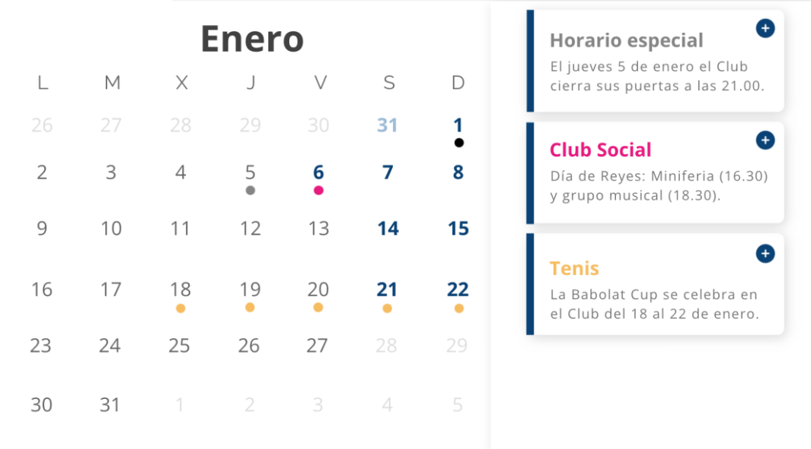

# MODERNIZACIÓN DE UN CLUB DEPORTIVO

## Miembros del grupo L1-AFM-1 

1. Guerrero López, Álvaro
2. Morón García, Pablo
3. Vargas Bellido, Juan Manuel
4. Morales Jiménez, Javier
<div style="text-align: justify;">

## 1. Introducción al problema
- *Descripción del problema para poner en contexto el proyecto, incluyendo información sobre los clientes y usuarios, la situación actual, problemas, expectativas, etc. Se valorará la presencia de información multimedia (fotos, gráficos, documentos escaneados, etc.)*.

En este proyecto nos disponemos a llevar a cabo una plataforma para un club deportivo que ha demandado nuestro servicio. Este club oferta multitud de servicios tales como, la práctica de deportes como padel o tenis, o una gran cantidad de actividades para poder realizar en familia. Cabe destacar a su vez, la presencia de cursos deportivos de distintos deportes, donde se pueden inscribir tanto socios como no socios.

Hasta este momento, las gestiones de los procesos más importantes y administrativos, como la gestión de socios o reserva de servicios, se han desarrollado de manera tradicional, ya sea por atención telefónica o personal. Este sistema trae consigo retrasos y dificultades. Para frenar esto, se quiere implementar una plataforma digital que permita gestionar estos servicios de manera rápida y efectiva. Todo esto permitirá una mejor administración generalizada del club por medio de los socios y un mayor control del equipo administrativo sobre la gestión del mismo, evitando fallas e ineficiencias pasadas. Un ejemplo de la antigüedad es la propia página web, la cual ha caído casi al completo desuso:

<div style="text-align: center; margin: 20px; padding-top: 5px;">
    
</div>

Entre los problemas destacamos la lentitud en el acceso por la gestión manual de los socios, ya que se debe comprobar el nombre y el número de socio, además de intentar evitar errores. En relación a la lentitud, la forma de reserva actual tanto de servicios como para la inscripción a los cursos presenta esta dificultad. A nivel informativo también hay carencias debido a que no existe ningún lugar donde poder ver las fechas importantes, como periodicidad de los cursos o eventos especiales del club. 
Para la resolución de los problemas actuales hemos pensado traer una serie de cambios que pueden permitir al club no perder su esencia mientras que se llega a modernizar del todo:

- ***Reserva de instalaciones y servicios*** 
- ***Inscripciones a los distintos cursos*** 
- ***Programación del club*** 

Todo esto se verá reflejado en la página web, de la cual hemos hecho un prototipo de lo que queremos llegar a obtener:

<div style="text-align: center; margin: 20px; padding-top: 10px;">
    
</div>


Por último, es importante recalcar cuales son los usuarios que se beneficiarán del sistema. Estos serán:

- ***Clientes (socios y no socios)***
- ***Equipo administrativo del club***


## 2. Glosario de términos

*Términos específicos del dominio del problema, ordenados alfabéticamente. Se valorará la presencia de información multimedia.*

- <u>***Usuarios:***</u> Cualquier persona que acceda al sistema ya sea socio, no socio o administrador.
- <u>***Clientes:***</u> Personas que hacen uso de los servicios del club, pueden ser socios o no socios.
- <u>***Socios:***</u> Personas que pagan la cuota mensual del club para disfrutar de los distintos servicios que este ofrece.
- <u>***No socios:***</u> Personas que no pagan la cuota pero que pueden entrar, de forma limitada, para asistir a las clases de los distintos cursos que el club oferta. NO podrán asistir a la mayoría de servicios y su entra y salida tendrá hora máxima.
- <u>***Equipo administrativo:***</u> Conjunto de personas que trabajan en las gestiones del club. Este grupo tiene acceso al sistema de información con fin de mejorar y mantener el sistema actualizado.
- <u>***Servicios:***</u> Conjunto de actividades que el propio club oferta a sus socios, tales como cursos, disponibilidad de pistas y salones de eventos para su reserva, entre otros.
- <u>***Reservas:***</u> Custodia de una pista/servicio del club, asociada a un periodo de tiempo, con un precio asignado a socios/no socios.
- <u>***Eventos:***</u> Acontecimiento que se realiza en el club un día concreto, ya sea un torneo o celebración.
- <u>***Cuota:***</u> Pago mensual que hace un socio del club. El precio varía según la R.N.04.
- <u>***Periodicidad:***</u> Horario de cada curso ofrecido por el club.
- <u>***Programación:***</u> Cuadrante con las distintas actividades o eventos que se realicen a lo largo del año.

<div style="text-align: center; margin: 20px; padding-top: 5px;">
    
</div>

## 3. Visión general del sistema

### 3.1. Requisitos generales                  
<div style="padding-left: 40px;">

En la introducción mencionamos diversos requisitos que trataremos de implementar en nuestra plataforma con el objetivo de alcanzar las expectativas. 

- **OBJ General:** Modernizar y optimizar el sistema del club, permitiendo a su vez un mayor control de los datos.

- **OBJ1 Gestión de reservas e inscripciones:**
El sistema podrá gestionar las reservas de las instalaciones y las distintas inscripciones, tanto del propio club como de los mismos cursos del mismo.

- **OBJ2 Mejor acceso a la información:**
Mejorar la oferta de información y noticias del club como horarios de apertura, cierre de cursos o eventos especiales del club.


</div>


### 3.2. Usuarios del sistema

- **Socio:** Toda persona que paga la cuota mensual del club y que tiene derecho a disfrutar de la totalidad de sus servicios. Estos tendrán acceso a diversos apartados dedicados a ellos, como realizar reservas y eventos, consultar las reservas hechas, ver su cuota a pagar o pagada, etc.
- **No socios:** EL resto de personas que no pagan la cuota y que, por tanto, no tienen acceso al club, exceptuando el caso en el que están inscritos en un curso ofertada por el mismo. Además, podrán ver el calendario y podrán obtener información acerca del club y de los cursos que se ofertan, además de la opción a apuntarse a alguna de ellos.
- **Administradores:** Tienen acceso al sistema por dentro, pudiendo añadir o quitar eventos, editar información del sistema, atender reservas por vía telefónica y añadirlas. Todas las incidencias que se lleven a cabo serán atendidas por ellos y tendrán como objetivo la resolución de las mismas con la meta de satisfacer los problemas de los distintos socios.

## 4. Catálogo de requisitos

### 4.1. Requisitos funcionales
<div style="padding-left: 40px;">

#### <u>**R.F.01. Crear usuarios**</u>

Como Administrador  
quiero poder añadir usuarios al sistema  
para que puedan registrarse como socios, no socios o administradores.

<div style="padding-left: 40px;">

**Prueba de aceptación**  
- Si se ha añadido el usuario al sistema, se enviará un correo de bienvenida al mismo.  
- Si los datos son incorrectos o el correo ya existe en el sistema, el usuario no será añadido, y se informará del error.  
- El usuario recién creado no podrá acceder a áreas restringidas del sistema hasta que se le asigne un rol (socio, no socio o administrador).  

</div>

#### <u>**R.F.02. Modificar usuarios**</u>

Como Administrador  
quiero poder modificar los datos de los usuarios del sistema  
para corregir errores o actualizar información personal.

<div style="padding-left: 40px;">

**Prueba de aceptación**  
- Al modificar un dato del usuario, el cambio se reflejará correctamente en el sistema.  
- Si no se puede realizar la modificación, se informará del error correspondiente.  

</div>

#### <u>**R.F.03. Listar usuarios**</u>

Como Administrador  
quiero poder listar los usuarios del sistema  
para gestionar roles, verificar información o enviar comunicaciones.  

<div style="padding-left: 40px;">

**Prueba de aceptación**  
- Al listar, se mostrará información relevante como nombre, apellidos, correo y tipo de usuario (socio, no socio, administrador).

</div>

#### <u>**R.F.04. Borrar usuarios**</u>

Como Administrador  
quiero poder eliminar usuarios del sistema  
para garantizar que sus datos no estén disponibles si ya no pertenecen al club.  

<div style="padding-left: 40px;">

**Prueba de aceptación**  
- Si se elimina correctamente, el usuario no podrá iniciar sesión ni aparecerá en los listados del sistema.  
- Si el usuario eliminado aún puede acceder o sus datos permanecen visibles, se habrá producido un error y este se notificará.  
- Si el usuario eliminado era socio o no socio, también se eliminarán sus reservas, pagos y cualquier otra información asociada.  

</div>


#### <u>***R.F.05. Crear socios***</u>

Como Administrador
quiero poder añadir socios al sistema
para que aparezcan los usuarios en la base de datos con dicho rol. 

<div style="padding-left: 40px;">

**Prueba de aceptación**
- Si se ha añadido el socio al sistema, se enviará un correo de confirmación al mismo.
- Si no ha pagado la cuota o no se ha añadido al sistema, no podrá acceder al sistema, y no se le enviará un correo de confirmación al socio.
- Se aplicará la +.03 (Se cobrará la suscripción el día 1 de cada mes. Si no se ha pagado en los siguientes 7 días, se le suspenderá la suscripción como socio).

</div>

#### <u>***R.F.06. Modificar socios***</u>

Como Administrador
quiero poder modificar los socios del sistema
para poder solucionar o consultar cualquier problema o duda que puedan tener los socios.

<div style="padding-left: 40px;">

**Prueba de aceptación**
- Cambiar un dato de un socio, y si se ha cambiado sin problemas, se verá cambiado en el sistema.
- Si no se cambia correctamente, hay un error del tipo correspondiente.

</div>

#### <u>***R.F.07. Listar socios***</u>

Como Administrador
quiero poder listar los socios del sistema
para poder organizarlos a gusto.

<div style="padding-left: 40px;">

**Prueba de aceptación**
- Al listar, se mostrará información relevante acerca del socio.

</div>

#### <u>***R.F.08. Borrar socios***</u>

Como Administrador
quiero poder eliminar socios
para poder borrar sus datos si se han marchado del club

<div style="padding-left: 40px;">

**Prueba de aceptación**
- Si se hace correctamente, el socio no podrá acceder al sistema ni saldrá en el listado. 
- Si el que era socio puede acceder a los servicios del club, no se habrá eliminado correctamente.

</div>


#### <u>**R.F.09. Crear no socios**</u>

Como Administrador  
quiero poder añadir no socios al sistema  
para que puedan participar en cursos.

<div style="padding-left: 40px;">

**Prueba de aceptación**  
- Si se ha añadido el no socio al sistema, se enviará un correo de bienvenida al mismo.  
- Si los datos proporcionados son incorrectos o el correo ya existe en el sistema, el no socio no será añadido, y se informará del error.  
- El no socio podrá participar en cursos y realizar reservas si cumple con los requisitos establecidos.  

</div>

#### <u>**R.F.10. Modificar no socios**</u>

Como Administrador  
quiero poder modificar los datos de los no socios  
para corregir errores o actualizar información personal.

<div style="padding-left: 40px;">

**Prueba de aceptación**  
- Al modificar un dato de un no socio, el cambio se reflejará correctamente en el sistema.  
- Si no se puede realizar la modificación, se informará del error correspondiente, como datos inválidos o restricciones de seguridad.  

</div>

#### <u>**R.F.11. Listar no socios**</u>

Como Administrador  
quiero poder listar los no socios del sistema  
para gestionar su información y organizar su acceso a los servicios.

<div style="padding-left: 40px;">

**Prueba de aceptación**  
- Al listar, se mostrará información relevante como nombre, apellidos, correo y DNI de los no socios.

</div>

#### <u>**R.F.12. Borrar no socios**</u>

Como Administrador  
quiero poder eliminar no socios del sistema  
para garantizar que sus datos no estén disponibles si ya no participan en las actividades del club.

<div style="padding-left: 40px;">

**Prueba de aceptación**  
- Si se elimina correctamente, el no socio no podrá realizar reservas ni participar en cursos, y sus datos desaparecerán del sistema.  
- Si el no socio eliminado aún puede acceder o realizar acciones en el sistema, se habrá producido un error, y se notificará al administrador.  

</div>


#### <u>**R.F.13. Crear administrador**</u>

Como Administrador  
quiero poder añadir administrador al sistema  
para que puedan tener los privilegios de este.

<div style="padding-left: 40px;">

**Prueba de aceptación**  
- Si se ha añadido el administrador al sistema, se mostrará el cambio en el sistema.  
- Si no se hace correctamene, se notificará del error.  
- El administrador dispondrá de los privilegios de administrador tales como crear reservas, socios, etc.  

</div>

#### <u>**R.F.14. Listar administrador**</u>

Como Administrador  
quiero poder listar los administradores del sistema  
para controlar los usuarios que disponen de los servicios de ser administrador.

<div style="padding-left: 40px;">

**Prueba de aceptación**  
- Al listar, se mostrarán todos los administradores que están en el sistema.

</div>

#### <u>**R.F.15. Borrar administrador**</u>

Como Administrador  
quiero poder eliminar administradores que ya no lo sean  
para garantizar la seguridad de los usuarios.

<div style="padding-left: 40px;">

**Prueba de aceptación**  
- Si se elimina correctamente, el ex-administrador, ya no podrá crear o eliminar socios, crear resevas, etc.  
- Si el administrador eliminado aún puede acceder o realizar acciones en el sistema, se habrá producido un error, y este se notificará.  

</div>


#### <u>***R.F.16. Inicio de sesión***</u>

Como socio
quiero poder iniciar sesión 
para acceder a mis privilegios como socio del club.

<div style="padding-left: 40px;">

**Prueba de aceptación** 

- Iniciar sesión con su respectivo correo y contraseña y hecho esto que
acceda a los apartados que solo los socios tienen acceso.
- Iniciar sesión con una combinacion de correo y contraseña incorrectos y se impide su acceso. 
- Intentar acceder a un apartado exclusivo para socios desde un perfil de 
no-socio y que se muestre un mensaje avisando de que hay que ser socio para 
disfrutar de dicho apartado impidiendo su acceso. 
</div>


#### <u>**R.F.17. Crear invitados**</u>

Como Socio  
quiero poder invitar a no socios o no usuarios del sistema
para que puedan acceder al club temporalmente.

<div style="padding-left: 40px;">

**Prueba de aceptación**  
- Si se ha añadido el invitado al sistema, se registrará su relación con el socio correspondiente.  
- Si los datos proporcionados son incorrectos, el invitado no será añadido, y se informará del error.  
- Un socio puede registrar un número limitado de invitados según las normas del club.  

</div>

#### <u>**R.F.18. Modificar invitados**</u>

Como Socio,  
quiero poder modificar los datos de mis invitados registrados
para corregir errores o actualizar información.

<div style="padding-left: 40px;">

**Prueba de aceptación**  
- Al modificar un dato de un invitado, el cambio se reflejará correctamente en el sistema.  
- Si no se puede realizar la modificación, se informará del error correspondiente, como datos inválidos o restricciones de seguridad.  

</div>

#### <u>**R.F.19. Listar invitados**</u>

Como Administrador  
quiero poder listar los invitados que he registrado  
para supervisar que no usuario o no socio tiene acceso al club de forma extraordinaria.

<div style="padding-left: 40px;">

**Prueba de aceptación**  
- Al listar, se mostrará información relevante como nombre, apellidos, y fechas de acceso de los invitados.

</div>

#### <u>**R.F.20. Borrar invitados**</u>

Como Socio
quiero poder eliminar a mis invitados registrados  
para restringir su acceso al club si ya no es necesario.

<div style="padding-left: 40px;">

**Prueba de aceptación**  
- Si se elimina correctamente, el invitado no podrá acceder al club ni aparecerá en el listado de invitados del socio.  
- Si el invitado eliminado aún puede acceder al club, se habrá producido un error, y se notificará.  

</div>


#### <u>**R.F.21. Registrar tiempo de entrada y salida de invitados**</u>

Como Socio  
quiero poder registrar las horas de entrada y salida de mis invitados  
para cumplir con las normas de acceso del club. 

<div style="padding-left: 40px;">

**Prueba de aceptación**  
- Si se registra correctamente el tiempo de entrada y salida de un invitado, este será guardado en el sistema asociado al socio correspondiente.  
- Si los datos son inválidos (por ejemplo, la fecha de salida es anterior a la de entrada), se mostrará un error y no se guardará el registro.  
- Los invitados solo podrán estar en el club durante el tiempo especificado.  

</div>

#### <u>**R.F.22. Modificar registro de tiempo de invitados**</u>

Como Administrador  
quiero poder modificar los registros de entrada y salida de invitados  
para corregir errores o atender solicitudes de socios.  

<div style="padding-left: 40px;">

**Prueba de aceptación**  
- Al modificar un registro, el nuevo tiempo de entrada o salida se reflejará correctamente en el sistema.  
- Si no se puede realizar la modificación por violar normas o restricciones (como exceder el tiempo permitido), se mostrará un mensaje de error.  

</div>

#### <u>**R.F.23. Listar tiempo de entrada y salida de invitados**</u>

Como Administrador  
quiero poder listar los tiempos de entrada y salida de los invitados  
para supervisar y garantizar el cumplimiento de las normas del club.

<div style="padding-left: 40px;">

**Prueba de aceptación**  
- Al listar, se mostrará información relevante como nombre del invitado, socio asociado, fecha de entrada y fecha de salida.

</div>

#### <u>**R.F.24. Borrar registro de tiempo de invitados**</u>

Como Administrador  
quiero poder eliminar registros de entrada y salida de invitados  
para corregir errores o mantener la base de datos limpia.  

<div style="padding-left: 40px;">

**Prueba de aceptación**  
- Si se elimina correctamente un registro, este desaparecerá del sistema y no aparecerá en los listados.  
- Si el registro eliminado sigue visible o afecta la supervisión, se mostrará un error y se notificará al administrador.  

</div>


#### <u>**R.F.25. Crear suscripciones**</u>

Como Administrador  
quiero poder crear suscripciones para los socios  
para que puedan disponer de nuevos planes de suscripción ya sean ofertas o nuevos planes.

<div style="padding-left: 40px;">

**Prueba de aceptación**  
- Si la suscripción se crea correctamente, el socio podrá acceder a los servicios del club según el tipo seleccionado (NORMAL, REDUCIDA, OFERTA).  
- Si los datos proporcionados son inválidos, se mostrará un error y no se creará la suscripción.

</div>

#### <u>**R.F.26. Modificar suscripciones**</u>

Como Administrador  
quiero poder modificar las suscripciones existentes  
para actualizar el tipo de suscripción o el precio si es necesario.

<div style="padding-left: 40px;">

**Prueba de aceptación**  
- Al modificar una suscripción, el cambio se reflejará correctamente en el sistema.  
- Si el cambio no es válido (por ejemplo, un precio negativo), se mostrará un mensaje de error y no se aplicará la modificación.  

</div>

#### <u>**R.F.27. Listar suscripciones**</u>

Como Administrador  
quiero poder listar las suscripciones existentes  
para poder gestionar y supervisar las distintas suscripciones adheridas al sistema.

<div style="padding-left: 40px;">

**Prueba de aceptación**  
- Al listar, se mostrará información relevante como tipo de suscripción, precio, estado actual y el socio asociado.  

</div>

#### <u>**R.F.28. Borrar suscripciones**</u>

Como Administrador  
quiero poder eliminar suscripciones  
para dejar de facturar a socios que ya no quieren continuar.

<div style="padding-left: 40px;">

**Prueba de aceptación**  
- Si se elimina correctamente, la suscripción desaparecerá del sistema, y no se facturará al socio en el próximo ciclo.  
- Si la suscripción eliminada sigue activa o aparece en listados, se mostrará un error y se notificará al administrador.  

</div>

#### <u>**R.F.29. Registrar pagos suscripción**</u>

Como Administrador  
quiero poder registrar los pagos realizados por los socios y no socios  
para llevar un control de las transacciones del club.

<div style="padding-left: 40px;">

**Prueba de aceptación**  
- Si el pago se registra correctamente, quedará asociado al socio o no socio correspondiente en el sistema.  
- Si los datos son inválidos (por ejemplo, un importe negativo), se mostrará un mensaje de error y no se registrará el pago.  

</div>

#### <u>**R.F.30. Modificar pagos suscripción**</u>

Como Administrador  
quiero poder modificar la información de un pago registrado  
para corregir errores o ajustar detalles.

<div style="padding-left: 40px;">

**Prueba de aceptación**  
- Al modificar un pago, los cambios se reflejarán correctamente en el sistema y en los reportes relacionados.  
- Si no se puede realizar la modificación debido a restricciones o datos inválidos, se notificará al administrador con un mensaje de error.  

</div>

#### <u>**R.F.31. Listar pagos suscripción**</u>

Como Administrador  
quiero poder listar los pagos realizados  
para supervisar las transacciones del club.

<div style="padding-left: 40px;">

**Prueba de aceptación**  
- Al listar, se mostrará información relevante como el método de pago, la fecha, el importe y la persona asociada (socio o no socio).  

</div>

#### <u>**R.F.32. Eliminar pagos suscripción**</u>

Como Administrador  
quiero poder eliminar registros de pagos  
para corregir errores o mantener la base de datos limpia.

<div style="padding-left: 40px;">

**Prueba de aceptación**  
- Si se elimina correctamente un registro de pago, este desaparecerá del sistema y no se reflejará en los reportes financieros.  
- Si el registro eliminado sigue visible o afecta las estadísticas del sistema, se notificará al administrador del error.  

</div>

#### <u>**R.F.33. Crear pistas**</u>

Como Administrador  
quiero poder registrar nuevas pistas en el sistema  
para que puedan ser reservadas por los socios.

<div style="padding-left: 40px;">

**Prueba de aceptación**  
- Si la pista se registra correctamente, quedará disponible para su reserva en el sistema.  
- Si los datos son inválidos (por ejemplo, nombre vacío o capacidad negativa), se mostrará un mensaje de error y no se guardará la pista.  

</div>

#### <u>**R.F.34. Modificar pistas**</u>

Como Administrador  
quiero poder modificar la información de las pistas registradas  
para actualizar sus datos o corregir errores.

<div style="padding-left: 40px;">

**Prueba de aceptación**  
- Al modificar una pista, los cambios se reflejarán correctamente en el sistema, y los usuarios verán la información actualizada al realizar reservas.  
- Si no se puede realizar la modificación por restricciones o datos inválidos, se notificará al administrador con un mensaje de error.  

</div>

#### <u>**R.F.35. Listar pistas**</u>

Como Administrador  
quiero poder listar todas las pistas registradas  
para supervisar su disponibilidad y características.

<div style="padding-left: 40px;">

**Prueba de aceptación**  
- Al listar, se mostrará información relevante como el nombre, tipo, capacidad máxima y estado actual de cada pista.  

</div>

#### <u>**R.F.36. Eliminar pistas**</u>

Como Administrador  
quiero poder eliminar pistas del sistema  
para dejarlas fuera de uso o porque ya no están disponibles.

<div style="padding-left: 40px;">

**Prueba de aceptación**  
- Si se elimina correctamente una pista, esta desaparecerá del sistema y no podrá ser reservada por los usuarios.  
- Si la pista eliminada sigue disponible para reservas o visible en listados, se notificará al administrador del error.  

</div>

#### <u>**R.F.37. Crear reservas (socio)**</u>

Como Socio
quiero poder crear reservas
para poder utilizar el servicio reservado.

<div style="padding-left: 40px;">

**Prueba de aceptación**
- Si se ha creado la reserva, se enviará un correo de confirmación.
- Si no se ha hecho correctamente, dará error y el socio no recibirá un correo de confirmación.
- En caso de que un no-socio intente hacer una reserva se aplicara la R.N.05 (solo los socios y administradores tendrán permitido hacer reservas de servicios del club) y no se hará la reserva.
- R.N.06 cada socio sólo podrá hacer 2 reservas de forma simultánea.
- En caso de que se haga la reserva con una antelacion superior a 15 días se aplicará la R.N.07 (Las reservas de pistas se deberán hacer con un máximo de 15 de días de antelación). 
- Si ya hay una reserva en el horario pedido se aplicará la R.N.08 (No se deben solapar reservas en la misma fecha y hora) y no se hará la reserva.

</div>

#### <u>**R.F.38. Crear reservas (administrador)**</u>

Como administrador
quiero poder crear reservas
para poder utilizar el servicio reservado.

<div style="padding-left: 40px;">

**Prueba de aceptación**
- Si se ha creado la reserva, se enviará un correo de confirmación.
- Si no se ha hecho correctamente, dará error y el socio no recibirá un correo de confirmación.
- En caso de que un no-socio intente hacer una reserva se aplicara la R.N.05 (solo los socios y administradores tendrán permitido hacer reservas de servicios del club) y no se hará la reserva.
- Si ya hay una reserva en el horario pedido se aplicará la R.N.08 (No se deben solapar reservas en la misma fecha y hora) y no se hará la reserva.
- En caso de que se haga la reserva con una antelacion superior a 15 días se aplicará la R.N.08 (Las reservas de pistas se deberán hacer con un máximo de 15 de días de antelación). 


</div>

#### <u>**R.F.39. Modificar reservas**</u>
Como administrador 
quiero poder modificar los datos de las reservas 
para solventar posibles problemas de los demás usuarios.

<div style="padding-left: 40px;">

**Prueba de aceptación**
- Si se ha modificado correctamente, el socio recibirá un correo confirmando la modificación.
- Si no se ha hecho correctamente, dará error y no recibirá el correo.
- Si ya hay una reserva en el horario pedido se aplicará la R.N.9 (No se deben solapar reservas en la misma fecha y hora) y no se hará la modificacion.
- En caso de que se haga la reserva con una antelacion superior a 15 días se aplicará la R.N.08 (Las reservas de pistas se deberán hacer con un máximo de 15 de días de antelación). 

</div>

#### <u>**R.F.40. Listar reservas**</u>

Como Administrador
quiero poder listar las reservas del sistema
para poder organizarlas a gusto.

<div style="padding-left: 40px;">

**Prueba de aceptación**
- Si se ha modificado correctamente, el listado se mostrará en el sistema modificado.
- Si no se ha hecho correctamente, el listado aparecerá de igual manera en el sistema.
</div>

#### <u>**R.F.41. Borrar reservas (Administrador)**</u>

Como administrador 
quiero poder borrar reservas 
para poder borrar reservas a peticion de un socio de forma presencial o por via telefonica.

<div style="padding-left: 40px;">

**Prueba de aceptación**
- Si se ha borrado correctamente, se le enviará un correo al socio que habia reservado.
- Si no se ha hecho correctamente, dará error y el socio no recibirá el correo.
</div>

#### <u>**R.F.42. Borrar reservas (Socio)**</u>

Como socio 
quiero poder borrar reservas 
para poder dar disponibilidad a otro socio de la instalación correspondiente a la reserva.

<div style="padding-left: 40px;">

**Prueba de aceptación**
- Si se ha borrado correctamente, se le enviará un correo al socio que habia reservado.
- Si no se ha hecho correctamente, dará error y el socio no recibirá el correo.
</div>

#### <u>**R.F.43. Inscripción a los cursos**</u>

Como cliente
quiero poder disponer de la información necesaria sobre los cursos adheridos al club
para poder realizar las propias inscripciones desde la plataforma pese a no ser socio.

<div style="padding-left: 40px;">

**Prueba de aceptación**
- Si se ha hecho correctamente, el cliente recibirá un correo con la confirmación de la inscripción al curso.
- Si no se ha realizado correctamente, el cliente no recibirá correo de confirmación de la inscripción al curso y no tendrá asociado ningún curso.
</div>

#### <u>**R.F.44. Crear eventos**</u>

Como Administrador  
quiero poder registrar nuevos eventos en el sistema  
para que los socios puedan participar en actividades organizadas por el club.

<div style="padding-left: 40px;">

**Prueba de aceptación**  
- Si el evento se crea correctamente, aparecerá en el sistema con la información correspondiente y asociado a una reserva específica.  
- Si los datos son inválidos (por ejemplo, fechas incorrectas o descripción vacía), se mostrará un mensaje de error y no se guardará el evento.  

</div>

#### <u>**R.F.45. Modificar eventos**</u>

Como Administrador  
quiero poder modificar la información de los eventos registrados  
para actualizar sus datos o corregir errores.

<div style="padding-left: 40px;">

**Prueba de aceptación**  
- Al modificar un evento, los cambios se reflejarán correctamente en el sistema, y los usuarios verán la información actualizada.  
- Si no se puede realizar la modificación debido a restricciones o datos inválidos, se notificará al administrador con un mensaje de error.  

</div>

#### <u>**R.F.46. Listar eventos**</u>

Como Administrador  
quiero poder listar todos los eventos registrados  
para supervisar su organización y detalles.

<div style="padding-left: 40px;">

**Prueba de aceptación**  
- Al listar, se mostrará información relevante como nombre, fecha, descripción y la reserva asociada a cada evento.  

</div>

#### <u>**R.F.47. Eliminar eventos**</u>

Como Administrador  
quiero poder eliminar eventos del sistema  
para cancelar actividades que ya no se realizarán o depurar el sistema.

<div style="padding-left: 40px;">

**Prueba de aceptación**  
- Si se elimina correctamente un evento, este desaparecerá del sistema y no estará disponible para los usuarios.  
- Si el evento eliminado sigue visible o accesible, se notificará al administrador del error.  

</div>

#### <u>***R.F.48. Crear curso***</u>

Como Administrador
quiero poder añadir cursos al sistema
para que aparezcan en el sistema.

<div style="padding-left: 40px;">

**Prueba de aceptación**
- Si se ha realizado correctamente, en el sistema aparecerá un nuevo curso en el apartado de cursos.
- Si no se ha realizado correctamente, en el sistema no deberá aparecer ningún nuevo curso.

</div>

#### <u>***R.F.49. Modificar curso***</u>

Como Administrador
quiero poder modificar los cursos del sistema
para poder cambiar los valores asociados al mismo ya sea el dia de inicio, fin, etc.

<div style="padding-left: 40px;">

**Prueba de aceptación**
- Si se ha realizado correctamente, en el sistema deberá aparecer modificado el dato del curso cambiado por el administrador.
- Si no se ha realizado correctamente, el sistema deberá mostrar los mismos datos que había antes del intento de modificación del curso.
</div>

#### <u>***R.F.50. Listar curso***</u>

Como Administrador
quiero poder listar los cursos del sistema,
para poder organizarlos adecuadamente.

#### <u>***R.F.51. Borrar curso***</u>

Como Administrador
quiero poder eliminar cursos
para poder borrar sus datos si ya no se imparte este curso.

<div style="padding-left: 40px;">

**Prueba de aceptación**
- Si se hace correctamente, en el sistema no debería aparecer el curso borrado. 
- Si no se ha realizado correctamente, el sistema debería seguir mostrando el curso.
</div>

#### <u>**R.F.52. Registrar pagos de cursos**</u>

Como Administrador  
quiero poder registrar los pagos de cursos realizados por socios y no socios  
para llevar un control financiero de las inscripciones.

<div style="padding-left: 40px;">

**Prueba de aceptación**  
- Si el pago del curso se registra correctamente, quedará asociado al socio o no socio correspondiente y al curso específico en el sistema.  
- Si los datos son inválidos (por ejemplo, el curso no existe o el método de pago es inválido), se mostrará un mensaje de error y no se guardará el pago.  

</div>

#### <u>**R.F.53. Modificar pagos de cursos**</u>

Como Administrador  
quiero poder modificar la información de un pago de curso registrado  
para corregir errores o ajustar detalles.

<div style="padding-left: 40px;">

**Prueba de aceptación**  
- Al modificar un pago de curso, los cambios se reflejarán correctamente en el sistema, y los reportes financieros mostrarán la información actualizada.  
- Si no se puede realizar la modificación debido a restricciones o datos inválidos, se notificará al administrador con un mensaje de error.  

</div>

#### <u>**R.F.54. Listar pagos de cursos**</u>

Como Administrador  
quiero poder listar los pagos de cursos realizados  
para supervisar las transacciones relacionadas con los cursos ofrecidos.

<div style="padding-left: 40px;">

**Prueba de aceptación**  
- Al listar, se mostrará información relevante como el curso asociado, la fecha de pago, el importe y la persona que realizó el pago (socio o no socio).  

</div>

#### <u>**R.F.55. Eliminar pagos de cursos**</u>

Como Administrador  
quiero poder eliminar registros de pagos de cursos  
para corregir errores o mantener la base de datos limpia.

<div style="padding-left: 40px;">

**Prueba de aceptación**  
- Si se elimina correctamente un registro de pago de curso, este desaparecerá del sistema y no se reflejará en los reportes financieros.  
- Si el registro eliminado sigue visible o afecta las estadísticas del sistema, se notificará al administrador del error.  

</div>

#### <u>**R.F.56. Registrar periodicidades de cursos**</u>

Como Administrador  
quiero poder registrar las periodicidades de los cursos  
para organizar horarios y fechas de las sesiones de cada curso.

<div style="padding-left: 40px;">

**Prueba de aceptación**  
- Si la periodicidad se registra correctamente, quedará asociada al curso correspondiente con la información de días y horarios en el sistema.  
- Si los datos son inválidos (por ejemplo, horas fuera de rango o días duplicados), se mostrará un mensaje de error y no se guardará la periodicidad.  

</div>

#### <u>**R.F.57. Modificar periodicidades de cursos**</u>

Como Administrador  
quiero poder modificar la información de las periodicidades de los cursos  
para ajustar horarios o corregir errores.

<div style="padding-left: 40px;">

**Prueba de aceptación**  
- Al modificar una periodicidad, los cambios se reflejarán correctamente en el sistema, y los usuarios inscritos en el curso verán los nuevos horarios.  
- Si no se puede realizar la modificación debido a restricciones o datos inválidos, se notificará al administrador con un mensaje de error.  

</div>

#### <u>**R.F.58. Listar periodicidades de cursos**</u>

Como Administrador  
quiero poder listar las periodicidades registradas  
para supervisar y gestionar los horarios de los cursos.

<div style="padding-left: 40px;">

**Prueba de aceptación**  
- Al listar, se mostrará información relevante como el día, hora de inicio, hora de fin y el curso asociado a cada periodicidad.  

</div>

#### <u>**R.F.59. Eliminar periodicidades de cursos**</u>

Como Administrador  
quiero poder eliminar registros de periodicidades  
para reorganizar los horarios o eliminar información obsoleta.

<div style="padding-left: 40px;">

**Prueba de aceptación**  
- Si se elimina correctamente una periodicidad, esta desaparecerá del sistema y no estará asociada al curso correspondiente.  
- Si la periodicidad eliminada sigue visible o afecta la organización de horarios, se notificará al administrador del error.  

</div>

#### <u>***R.F.60. Control de pago de cuota de suscripción***</u>

Como socio
quiero comprobar el estado de mi suscripción
para gestionarla a gusto (cancelar, ver último pago, tiempo hasta siguiente pago, etc.)

<div style="padding-left: 40px;">

**Prueba de aceptación**
- Si es socio o no socio y realiza el pago de la cuota, el socio recibe un correo de confirmación de pago a la dirección asociada a la cuenta. Se debe aplicar la R.N.04 (Los niños menores de 3 años tendrán entrada gratuita al club. El precio de la suscripción para menores de 14 años y mayores de 65 será menor que la predeterminada).
- Si es socio y no realiza el pago, este no debe recibir un correo de confirmación de pago a la dirección asociada a la cuenta y se aplicará la regla de negocio R.N.03 (Se cobrará la suscripción el día 1 de cada mes, sin incluir el mes en el que se hace la inscripción. Si no se ha pagado en los siguientes 7 días, se le suspenderá la suscripción temporalmente). Al cancelar la suscripción, aparecerá un pop up para confirmar la acción, y al realizarse se enviará un correo de despedida al socio, ofreciendo feedback por parte del usuario del por qué ha decidido dejar el club.
- Si un no socio no paga la cuota este no no debe recibir un correo de confirmación de pago a la dirección asociada a la cuenta y no tendrá los beneficios de un socio.

</div>

#### <u>***R.F.61. Control de pago de cuota de curso***</u>

Como socio o no socio
quiero comprobar el estado de mi inscripción a los distintos cursos
para gestionarla a gusto (cancelar, ver último pago, tiempo hasta siguiente pago, etc.)

<div style="padding-left: 40px;">

**Prueba de aceptación**
- Si es socio o no socio y realiza el pago de la cuota del curso, el socio recibe un correo de confirmación de pago a la dirección asociada a la cuenta y tendrá acceso al curso pagado. 
- Si es socio o no socio y no realiza el pago, este no debe recibir un correo de confirmación de pago a la dirección asociada a la cuenta y no podrá acceder al curso.

</div>

</div>

### 4.1.1. Requisitos de información
<div style="padding-left: 40px;">

#### <u> **R.I.01. Gestión de Reservas** </u>
<div style="padding-left: 40px;">
Como administrador
quiero que se almacenen las reservas con su fecha y hora de inicio y fin ,el socio que la reserva, tipo de reserva, estado de la reserva, modificaciones o cancelaciones de la misma,
para poder gestionar todas las reservas de pistas o de servicios que se realizan en el club
</div>

#### <u>**R.I.02. Eventos**</u>
<div style="padding-left: 40px;">
Como usuario
quiero disponer de una programación donde poder ver la fecha de los eventos importantes del club, tales como torneos, la apertura de la piscina, y cierre de la misma, entre otros
para poder estar informado de las celebraciones y actividades que se realizan y poder asistir. 
</div>

#### <u>**R.I.03. PagosSuscripcion (socio)**</u>
<div style="padding-left: 40px;">
Como socio  
quiero que se registre la siguiente información sobre mis pagos de suscripción: historial de pagos (fecha e importe).
para estar informado sobre mi suscripción y poder gestionarla.
</div>

#### <u>**R.I.04. PagosSuscripcion (administrador)**</u>
<div style="padding-left: 40px;">
Como administrador  
quiero que se registre la siguiente información sobre los pagos de suscripción: fecha, importe y método de pago de las suscripciones realizadas en el club
para tener control de los pagos de las cuotas y estar informado de los ingresos del club.
</div>

#### <u>**R.I.05. Usuarios**</u>
<div style="padding-left: 40px;">
Como administrador  
quiero disponer de la siguiente información sobre los usuarios: nombre completo (nombre y apellidos), correo electrónico, fecha de nacimiento, y contraseña en formato encriptado  
para crear, modificar, listar y eliminar usuarios del sistema.
</div>

#### <u>**R.I.06. Socios**</u>
<div style="padding-left: 40px;">
Como administrador  
quiero disponer de la siguiente información sobre los socios: nombre completo (nombre y apellidos), DNI, teléfono, e ID de usuario asociado  
para crear, listar, modificar y eliminar socios del sistema.
</div>
 
#### <u>**R.I.07. No socios**</u>
<div style="padding-left: 40px;">
Como administrador  
quiero disponer de la siguiente información sobre los no socios: nombre completo (nombre y apellidos), DNI, teléfono, e ID de usuario asociado  
para crear, listar, modificar y eliminar no socios del sistema.
</div>

#### <u>**R.I.08. Pistas**</u>
<div style="padding-left: 40px;">
Como usuario  
quiero disponer de la siguiente información sobre las pistas: nombre y tipo de pista, capacidad máxima, y estado de disponibilidad  
para saber cuáles puedo o no usar en un momento concreto.
</div>

#### <u>**R.I.09. Suscripciones**</u>
<div style="padding-left: 40px;">
Como administrador  o usuario del sistema
quiero disponer de la siguiente información sobre las suscripciones: tipo de suscripción (normal, reducida, oferta), precio, e ID del usuario asociado  
para crear, modificar, listar y eliminar suscripciones del sistema.
</div>

#### <u>**R.I.10. Cursos (cliente)**</u>
<div style="padding-left: 40px;">
Como cliente  
quiero disponer de la siguiente información sobre los cursos: nombre del curso, precio, fecha de inicio y fin, y descripción opcional  
para consultar información sobre ellos y poder inscribirme.
</div>

#### <u>**R.I.11. Cursos (administrador)**</u>
<div style="padding-left: 40px;">
Como administrador  
quiero disponer de la siguiente información sobre los cursos: nombre del curso, precio, fecha de inicio y fin, e ID de los usuarios inscritos  
para crear, modificar, listar y eliminar cursos en el sistema.
</div>

#### <u>**R.I.12. Periodicidad**</u>
<div style="padding-left: 40px;">
Como usuario  
quiero disponer de la siguiente información sobre la periodicidad de los cursos: días de la semana en que se imparten y horarios de inicio y fin  
para poder planificar mi participación en los cursos.
</div>

#### <u>**R.I.13. Invitados**</u>
<div style="padding-left: 40px;">
Como administrador  
quiero disponer de la siguiente información sobre los invitados: nombre completo (nombre y apellidos), socio que los invitó, y fechas y horas de entrada y salida  
para consultar información sobre ellos en caso necesario.
</div>

#### <u>**R.I.14. PagosCursos(Clientes)**</u>
<div style="padding-left: 40px;">
Como cliente
quiero poder pagar los cursos 
para poder disfrutar del curso al que me he inscrito.
</div>

#### <u>**R.I.15. PagosCursos(Administradores)**</u>
<div style="padding-left: 40px;">
Como administrador  
quiero disponer de la siguiente información sobre los pagos de cursos: fecha y importe, curso asociado, y cliente (socio o no socio) que realizó el pago  
para consultar información sobre ellos en caso necesario.
</div>


</div>

### **4.1.2. Reglas de negocio**

<div style="padding-left: 40px;">

#### <u> **R.N.01. Número limitado de invitaciones** </u>
- Cada socio solo dispone de 12 entradas al mes para poder invitar a no socios.

#### <u> **R.N.02. Suscripciones** </u>
- Los nuevos socios deberán pagar la suscripción para poder completar el registro en el club. 

#### <u> **R.N.03. Día de pago de la suscripción** </u>
- Se cobrará la suscripción 30 dias despues de cada pago teniendo en cuenta que el primer pago tiene lugar en el momento en el que un cliente se hace socio.

#### <u> **R.N.04. Ofertas de cuotas** </u>
- Los niños menores de 3 años tendrán entrada gratuita al club. El precio de la suscripción para menores de 14 años y mayores de 65 será reducida un 20% con respecto a la suscripción base.

#### <u> **R.N.05. Reservas** </u>
- Solo los socios y administradores tendrán permitido hacer reservas de servicios del club. En caso de ser administrador este pondrá el número de socio por él.

#### <u> **R.N.06. Número reservas simultáneas** </u>
- Cada socio sólo podrá hacer 2 reservas de forma simultánea.

#### <u> **R.N.07. Máximo de días para poder reservar** </u>
- Las reservas de pistas se deberán hacer con un máximo de 15 de días de antelación.

#### <u> **R.N.08. Solape de reservas** </u> 
- No se deben solapar reservas en la misma fecha y hora.

</div>

### 4.2. Mapa de historias de usuario (opcional)


### 4.3. Requisitos no funcionales (opcional)
<div style="padding-left: 40px;">

#### **R.N.F.01. Disponibilidad de la plataforma**
<div style="padding-left: 40px;">

Como usuario,
quiero que la plataforma se conserve activa durante las 24 horas del día todos los días de la semana, sin necesidad de estar en horarios de oficina;
para poder realizar reservas de pistas y consultas de planes y precios de las distintas categorías propuestas por el club, como por ejemplo los cursos deportivos o la reserva del salón de celebraciones.
</div>

#### **R.N.F.02. Usabilidad**
<div style="padding-left: 40px;">

Como usuario,
quiero que la plataforma sea intuitiva o, técnicamente user-friendly, independientemente de mi edad,
para realizar la reserva o pago de las diferentes categorías propuestas por el club (reserva de pistas, pago de los cursos deportivos, reserva de salón...)  sin complicaciones a la hora de realizar el pago online, entre otras cosas.
</div>

#### **R.N.F.03. Portabilidad**
<div style="padding-left: 40px;">

Como usuario,
quiero que la plataforma sea ejecutable tanto en dispositivos móviles como las tablets y smartphones, como en dispositivos de sobremesa como los ordenadores o portátiles, siendo estas versiones adaptadas a la plataforma de despliegue
para poder realizar reservas desde cualquier lugar sin necesidad de tener que volver a mi domicilio para hacer dichas reservas.
</div>

#### **R.N.F.04. Rendimiento**
<div style="padding-left: 40px;">

Como usuario,
quiero que la plataforma responda a mis acciones en la web de forma eficiente y rápida,
para reducir el tiempo en el que realizo la reserva mencionada anteriormente.
</div>

#### **R.N.F.05. Seguridad**
<div style="padding-left: 40px;">

Como usuario,
quiero que la seguridad en el pago o la privacidad de mis datos sea extrema,
para no preocuparme por propocinar la información de las tarjetas bancarias que utilice en los pagos o la información que deposite sobre mí o mis parientes en la web.
</div>

#### **R.N.F.06. Compatibilidad**
<div style="padding-left: 40px;">

Como usuario,
quiero que la web, o aplicación web, se pueda desplegar tanto en IOS como en Android o en otras SO
para no tener que depender de una persona que si tenga un SO compatible al no tener yo uno no compatible.
</div>

#### **R.N.F.07. Copias de Seguridad**
<div style="padding-left: 40px;">

Como administrador del club,
quiero que el sistema disponga de copias de seguridad
para asegurar que, en caso de haber fallo en cualquier ámbito vulnerable a error, se puedan restaurar los datos y el funcionamiento del sistema en el menor tiempo posible.
</div>

#### **R.N.F.08. Robustez**
<div style="padding-left: 40px;">

Como usuario,
quiero que el sistema continue en correcto funcionamiento pesar de que puedan ocurrir fallos menores
para poder continuar con las gestiones, como reservas, sin perder la información ni el progreso alcanzado.
</div>

</div>

-- fin entregable 1 --

## 5. Modelo conceptual

### 5.1. Diagramas de clases UML


### 5.2. Escenarios de prueba

> Un socio llamado Pablo Morón García cuyo DNI es 53962040S y teléfono 677890427. Su correo es moronpablo05@gmail.com, su contraseña es 'pablomoron12345' y su cumpleaños el 18/03/2005. Este quiere realizar una reserva para jugar al padel. En concreto reserva la Pista 1 para el día 8 de noviembre para jugar de 11:00 a 12:30.


> Un no socio llamado Miguel Romero García con DNI 98765432M, número de telefono 678912345, su correo lupinrg@outlook.es y contraseña 'mirogar2004_'y cuyo cumpleaños es el día 9/10/2004, quiere apuntarse al curso de tenis. Su disponibilidad es el martes y jueves de 19:00 - 20:00. Quiere apuntarse para dar 8 clases durante todos los meses.


> Un socio llamado Pablo Morón García cuyo DNI es 53962040S, con teléfono 677890427 , correo moronpablo05@gmail.com, contraseña 'pablomoron12345' y fecha de nacimiento 15/03/2005, quiere invitar a un amigo suyo que no es socio, cuyo nombre es Miguel Romero García. Al invitar se deberá restar una invitación al número total de las mismas.


>Un socio llamado Álvaro Guerrero López con DNI 98765432D, fecha de nacimiento 27/10/2005, cuyo número de telefono es 622889990, correo alvaroguerr2014@gmail.com y contraseña 'contraseñaClub_' decide pagar la cuota como cada día 1 del mes. Finalmente el dia 1 de diciembre de 2024 por preferencia personal elige realizar una transferencia bancaria a la entidad con un importe de 105€ pagando asi la suscripción con el plan 'normal'.


## 6. Matrices de trazabilidad

- Matriz de trazabilidad entre los elementos del modelo conceptual y los requisitos.

|       | USUARIO    | SOCIO      | NO SOCIO   | ADMINISTRADOR | INVITADO  | TIEMPO INVITADO | SUSCRIPCIÓN | PAGO SUSCRIPCIÓN | PISTA   | RESERVA | EVENTO  | CURSO  | PAGO CURSO | PERIODICIDAD |
|:------|:----------:|:----------:|:----------:|:-------------:|:---------:|:---------------:|:-----------:|:----------------:|:-------:|:-------:|:-------:|:------:|:----------:|:------------:|
| RF-1  |     X      |            |            |       X       |           |                 |             |                  |         |         |         |        |            |              |
| RF-2  |     X      |            |            |       X       |           |                 |             |                  |         |         |         |        |            |              |
| RF-3  |     X      |            |            |       X       |           |                 |             |                  |         |         |         |        |            |              |
| RF-4  |     X      |            |            |       X       |           |                 |             |                  |         |         |         |        |            |              |
| RF-5  |     X      |     X      |            |       X       |           |                 |             |                  |         |         |         |        |            |              |
| RF-6  |     X      |     X      |            |               |           |                 |             |                  |         |         |         |        |            |              |
| RF-7  |     X      |     X      |            |       X       |           |                 |             |                  |         |         |         |        |            |              |
| RF-8  |     X      |     X      |            |       X       |           |                 |             |                  |         |         |         |        |            |              |
| RF-9  |     X      |            |     X      |       X       |           |                 |             |                  |         |         |         |        |            |              |
| RF-10 |     X      |            |     X      |               |           |                 |             |                  |         |         |         |        |            |              |
| RF-11 |     X      |            |      X     |               |           |                 |             |                  |         |         |         |        |            |              |
| RF-12 |     X      |            |     X      |               |           |                 |             |                  |         |         |         |        |            |              |
| RF-13 |     X      |            |            |       X       |           |                 |             |                  |         |         |         |        |            |              |
| RF-14 |     X      |            |            |       X       |           |                 |             |                  |         |         |         |        |            |              |
| RF-15 |     X      |            |            |       X       |           |                 |             |                  |         |         |         |        |            |              |
| RF-16 |     X      |     X      |            |               |           |                 |             |                  |         |         |         |        |            |              |
| RF-17 |     X      |     X      |            |               |     X     |                 |             |                  |         |         |         |        |            |              |
| RF-18 |     X      |     X      |            |               |     X     |                 |             |                  |         |         |         |        |            |              |
| RF-19 |     X      |     X      |            |               |     X     |                 |             |                  |         |         |         |        |            |              |
| RF-20 |     X      |     X      |            |               |     X     |                 |             |                  |         |         |         |        |            |              |
| RF-21 |     X      |     X      |            |       X       |     X     |        X        |             |                  |         |         |         |        |            |              |
| RF-22 |     X      |            |            |        X      |     X     |        X        |             |                  |         |         |         |        |            |              |
| RF-23 |     X      |            |            |         X     |     X     |        X        |             |                  |         |         |         |        |            |              |
| RF-24 |     X      |            |            |        X      |     X     |        X        |             |                  |         |         |         |        |            |              |
| RF-25 |     X      |            |            |       X       |           |                 |      X      |                  |         |         |         |        |            |              |
| RF-26 |     X      |            |            |        X      |           |                 |      X      |                  |         |         |         |        |            |              |
| RF-27 |     X      |            |            |         X     |           |                 |      X      |                  |         |         |         |        |            |              |
| RF-28 |     X      |            |            |          X    |           |                 |      X      |                  |         |         |         |        |            |              |
| RF-29 |     X      |            |            |       X       |           |                 |             |         X        |         |         |         |        |            |              |
| RF-30 |     X      |            |            |        X      |           |                 |             |         X        |         |         |         |        |            |              |
| RF-31 |     X      |            |            |         X     |           |                 |             |         X        |         |         |         |        |            |              |
| RF-32 |     X      |            |            |          X    |           |                 |             |         X        |         |         |         |        |            |              |
| RF-33 |     X      |            |            |        X      |           |                 |             |                  |    X    |         |         |        |            |              |
| RF-34 |     X      |            |            |        X      |           |                 |             |                  |    X    |         |         |        |            |              |
| RF-35 |     X      |            |            |         X     |           |                 |             |                  |    X    |         |         |        |            |              |
| RF-36 |     X      |            |            |          X    |           |                 |             |                  |    X    |         |         |        |            |              |
| RF-37 |     X      |     X      |            |               |           |                 |             |                  |         |    X    |         |        |            |              |
| RF-38 |     X      |            |            |       X       |           |                 |             |                  |         |    X    |         |        |            |              |
| RF-39 |     X      |            |            |       X       |           |                 |             |                  |    X    |    X    |         |        |            |              |
| RF-40 |     X      |            |            |       X       |           |                 |             |                  |    X    |    X    |         |        |            |              |
| RF-41 |     X      |            |            |       X       |           |                 |             |                  |    X    |    X    |         |        |            |              |
| RF-42 |     X      |     X      |            |               |           |                 |             |                  |         |    X    |         |        |            |              |
| RF-43 |     X      |     X      |     X      |               |           |                 |             |                  |         |         |         |    X   |            |              |
| RF-44 |     X      |            |            |       X       |           |                 |             |                  |         |         |    X    |        |            |              |
| RF-45 |     X      |            |            |       X       |           |                 |             |                  |         |         |    X    |        |            |              |
| RF-46 |     X      |            |            |       X       |           |                 |             |                  |         |         |    X    |        |            |              |
| RF-47 |     X      |            |            |       X       |           |                 |             |                  |         |         |    X    |        |            |              |
| RF-48 |     X      |            |            |       X       |           |                 |             |                  |         |         |         |    X   |            |              |
| RF-49 |     X      |            |            |       X       |           |                 |             |                  |         |         |         |    X   |            |              |
| RF-50 |     X      |            |            |       X       |           |                 |             |                  |         |         |         |    X   |            |              |
| RF-51 |     X      |            |            |       X       |           |                 |             |                  |         |         |         |    X   |            |              |
| RF-52 |     X      |            |            |       X       |           |                 |             |                  |         |         |         |    X   |      X     |              |
| RF-53 |     X      |            |            |        X      |           |                 |             |                  |         |         |         |    X   |      X     |              |
| RF-54 |     X      |            |            |         X     |           |                 |             |                  |         |         |         |    X   |      X     |              |
| RF-55 |     X      |            |            |          X    |           |                 |             |                  |         |         |         |    X   |      X     |              |
| RF-56 |     X      |            |            |        X      |           |                 |             |                  |         |         |         |    X   |            |      X       |
| RF-57 |     X      |            |            |         X     |           |                 |             |                  |         |         |         |    X   |            |      X       |
| RF-58 |     X      |            |            |          X    |           |                 |             |                  |         |         |         |    X   |            |      X       |
| RF-59 |     X      |            |            |           X   |           |                 |             |                  |         |         |         |    X   |            |      X       |
| RF-60 |     X      |     X      |            |               |           |                 |      X      |                  |         |         |         |        |            |              |
| RF-61 |     X      |     X      |     X      |               |           |                 |             |                  |         |         |         |    X   |      X     |              |
| RI-1  |     X      |            |            |       X       |           |                 |             |                  |         |    X    |         |        |            |              |
| RI-2  |     X      |     X      |      X     |               |           |                 |             |                  |         |         |    X    |        |            |              |
| RI-3  |     X      |     X      |            |               |           |                 |             |         X        |         |         |         |        |            |              |
| RI-4  |     X      |            |            |        X      |           |                 |             |         X        |         |         |         |        |            |              |
| RI-5  |     X      |            |            |        X      |           |                 |             |                  |         |         |         |        |            |              |
| RI-6  |     X      |     X      |            |       X       |           |                 |             |                  |         |         |         |        |            |              |
| RI-7  |     X      |            |    X       |         X     |           |                 |             |                  |         |         |         |        |            |              |
| RI-8  |     X      |     X      |            |     X         |           |                 |             |                  |    X    |         |         |        |            |              |
| RI-9  |     X      |            |            |      X        |           |                 |      X      |                  |         |         |         |        |            |              |
| RI-10 |     X      |     X      |     X      |               |           |                 |             |                  |         |         |         |    X   |            |              |
| RI-11 |     X      |            |            |       X       |           |                 |             |                  |         |         |         |    X   |            |              |
| RI-12 |     X      |     X      |     X      |               |           |                 |             |                  |         |         |         |    X   |            |      X       |
| RI-13 |     X      |            |            |       X       |     X     |                 |             |                  |         |         |         |        |            |              |
| RI-14 |     X      |     X      |     X      |               |           |                 |             |                  |         |         |         |    X   |      X     |              |
| RI-15 |     X      |            |            |       X       |           |                 |             |                  |         |         |         |    X   |      X     |              |
| RN-1  |     X      |     X      |            |               |     X     |                 |             |                  |         |         |         |        |            |              |
| RN-2  |     X      |     X      |            |               |           |                 |      X      |        X         |         |         |         |        |            |              |
| RN-3  |     X      |     X      |            |               |           |                 |      X      |         X        |         |         |         |        |            |              |
| RN-4  |     X      |     X      |            |               |           |                 |      X      |         X        |         |         |         |        |            |              |
| RN-5  |     X      |     X      |            |               |           |                 |             |                  |    X    |    X    |         |        |            |              |
| RN-6  |     X      |     X      |            |               |           |                 |             |                  |    X    |    X    |         |        |            |              |
| RN-7  |     X      |     X      |            |               |           |                 |             |                  |    X    |    X    |         |        |            |              |
| RN-8  |     X      |     X      |            |               |           |                 |             |                  |    X    |    X    |         |        |            |              |


- Incluir Reglas de negocio — Constraints/Triggers en las matrices de trazabilidad para el entregable 3

|        | RN-1   | RN-2   | RN-3   | RN-4   | RN-5   | RN-6   | RN-7   | RN-8   |
|:------:|:------:|:------:|:------:|:------:|:------:|:------:|:------:|:------:|
| TRIG-1 | X      |        |        |        |        |        |        |        |
| TRIG-2 | X      |        |        |        |        |        |        |        |
| TRIG-3 |        |  X     |        |        |        |        |        |        |
| TRIG-4 |        |        |  X     |        |        |        |        |        |
| TRIG-5 |        |        |        |  X     |        |        |        |        |
| TRIG-6 |        |        |        |        |   X    |        |        |        |
| TRIG-7 |        |        |        |        |        |   X    |        |        |
| TRIG-8 |        |        |        |        |        |        |  X     |        |
| TRIG-9 |        |        |        |        |        |        |        | X      |


-- fin entregable 2 --

## 7. Modelo relacional en 3FN

- Relaciones obtenidas al aplicar la transformación del modelo conceptual.

```sql
Usuarios(!id, #correo, contraseña, nombre, apellido1, apellido2, fechaNacimiento)

Socios(!id, dni, #telefono, numInvitaciones, @usuarioId)

NoSocios(!id, dni, #telefono, @usuarioId)

Administradores(!id, @usuarioId)

Invitados(!id, nombre, apellido1, apellido2, @socioId)

TiempoInvitados(!id, fechaEntrada, fechaSalida, @socioId, @invitadoId)

Suscripciones(!id, precio, fechaRealizacion, @socioId, tipoSuscripcion)

PagosSuscripcion(!id, @suscripcionId, importePagado, fechaRealizacion, @usuarioId, metodoPago)

Pistas(!id, nombre, tipo, capacidadMax)

Reservas(!id, fechaInicio, fechaFin, @socioId, @pistaId)

Eventos(!id, nombre, fecha, descripcion, @reservaId)

Cursos(!id, nombre, precio, inicioCurso, finCurso)

PagosCursos(!id, fechaRealizacion, metodoPago, @socioId, @noSocioId, @cursoId)

Periodicidad(!id, dia, horaInicio, horaFin, @cursoId)
```

### 7.1.  Justificación de la estrategia de transformación de jerarquías

- si se identificaron jerarquías en el MC.

-- fin entregable 3 --

## Referencias


